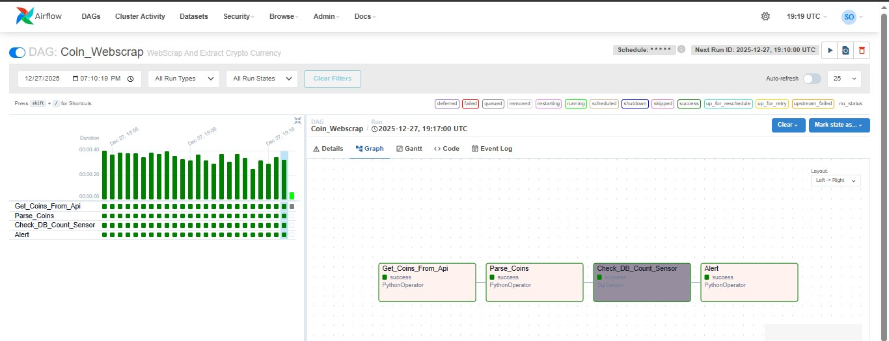
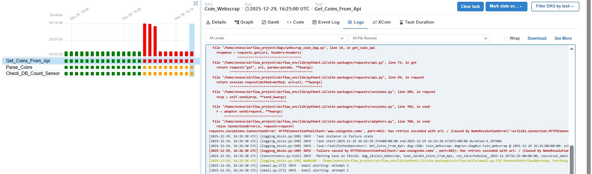
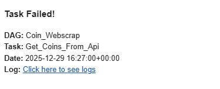
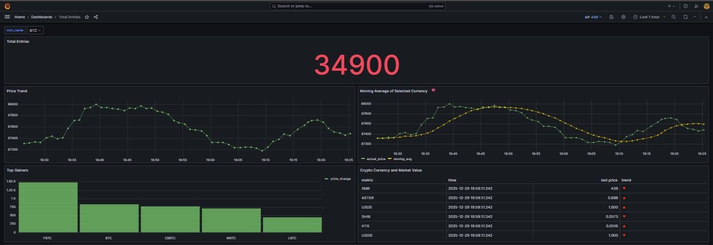

# 🚀 Crypto Data Pipeline with Apache Airflow & Email Alerting


An automated data monitoring pipeline that scrapes cryptocurrency data and delivers updates via **Telegram Bot**, featuring a robust fail-safe mechanism using **SMTP Email Alerts**.

## 📌 Project Overview
This pipeline automates the process of tracking crypto assets. It uses **BeautifulSoup** for web scraping and integrates with the **Telegram Bot API** to push real-time notifications. To ensure high availability, the project includes an automated email recovery notification if any part of the scraping or delivery process fails.

## 🛠 Tech Stack
* **Orchestration:** Apache Airflow.
* **Web Scraping:** BeautifulSoup4 (BS4) & Requests.
* **Messaging:** Telegram Bot API.
* **Alerting:** SMTP (Gmail) for failure notifications.

## 🏗 Pipeline Workflow
1.  **Web Scraping:** Extracts live crypto data from the source using BeautifulSoup.
2.  **Telegram Dispatch:** Sends the extracted data directly to a Telegram chat/channel.
3.  **Error Handling:** If the website structure changes or the API is unreachable, a failure callback is triggered.
4.  **Redundant Alerting:** Sends a critical failure report to the admin's email via Gmail SMTP.

## 📊 Data Insights & SQL Analysis
The project includes a custom PostgreSQL query to analyze price trends over the last hour. Using **Window Functions**, it calculates:
* **Moving Average:** To smooth out price volatility.
* **Trend Detection:** An automated status (🔺/🔻) comparing the last price vs. the average.

## 📸 Project Screenshots

| DAG Graph View (Success) | DAG Graph View (Fail) | Email Alert Notification (Failure)  | Grafana Dashboard | Telegram Bot Alert |
| :---: | :---: | :---: | :---: | :---: |
|  |  |  |  | 

## 🚀 Setup & Integration

  ### 1. Telegram Bot Setup
  * Create a bot via `@BotFather`.
  * Obtain your `TOKEN` and `CHAT_ID`.
  * Add these as Airflow Variables or environment variables.

### 2. SMTP Configuration
  Configure your Gmail SMTP settings in `airflow.cfg` or via Airflow UI Connections:
  * **Host:** `smtp.gmail.com`
  * **Port:** `587`
  * **User:** `your_email@gmail.com`
  * **Password:** `your_16_digit_app_password` (No spaces)

### 3. Requirements
  ```bash
  pip install apache-airflow beautifulsoup4 requests
```

## 💡 Key Learnings
  * Scheduling and managing complex workflows with **Airflow DAGs**.
  * Implementing **Custom Callbacks** for automated incident response.
  * Securing sensitive credentials using Environment Variables and Airflow Connections.
  * Troubleshooting network resolution and SMTP authentication issues.

✨ Developed by Sohaib Omar
Feel free to reach out for collaborations or questions!
🔗[](https://www.linkedin.com/in/sohaib-omar-188oo)
